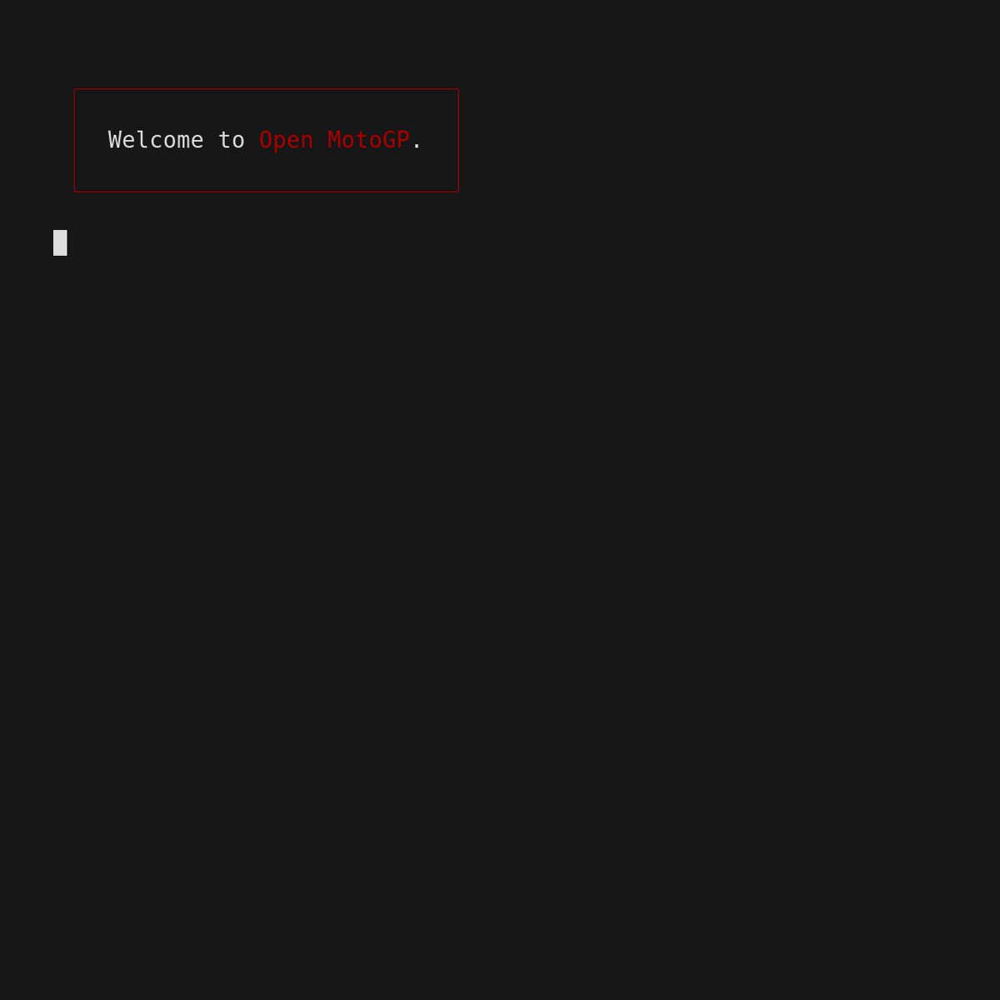

# Open MotoGP

## CLI App

The `open-mpg.sh` script is a simple CLI App to simpify downloading the classification for a single race.

### Getting Started

1. Must allow executable permission for the script with `chmod +x open-mpg.sh`.
2. Install `gum`. See [here](https://github.com/charmbracelet/gum?tab=readme-ov-file#installation) for details.
3. Run `./open-mpg.sh`

### Demo



## Endpoints

The values in the curly-braces `{}` are intended to be substituted with the
desired value. To use these you must call them in order using values from the
previous call to substitute into the next call.

- Season: <https://api.pulselive.motogp.com/motogp/v1/results/seasons>
- Event: <https://api.pulselive.motogp.com/motogp/v1/results/events?seasonUuid={season}&isFinished=true>
- Category: <https://api.pulselive.motogp.com/motogp/v1/results/categories?eventUuid={event}>
- Session: <https://api.pulselive.motogp.com/motogp/v1/results/sessions?eventUuid={event}&categoryUuid={category}>
- Classification: <https://api.pulselive.motogp.com/motogp/v1/results/session/{session}/classification?test=false>

### Example

Suppose we want the results for the **Gran Premio d’Italia Brembo 2024 for**
**MotoGP - RAC**.

This means we are looking for the following:

- Season: **2024**
- Event: **Gran Premio d’Italia Brembo**
- Category: **MotoGP™**
- Session: **RAC**

When working with the endpoints we don't use these exact values, we will be
working with their UUID which is returned in the request.

Let's start with the `season` endpoint, if we call `curl
"https://api.pulselive.motogp.com/motogp/v1/results/seasons"`, we get:

```json
[
    {
        "id": "dd12382e-1d9f-46ee-a5f7-c5104db28e43",
        "name": null,
        "year": 2024,
        "current": true
    },
    ...
]
```

Next, we call the `event` endpoint `curl
"https://api.pulselive.motogp.com/motogp/v1/results/events?seasonUuid=dd12382e-1d9f-46ee-a5f7-c5104db28e43&isFinished=true"`
with the `season.id` from above. This endpoint returns a lot of extra data...
I'll abbreviate them to the fields of interest.

```json
[
    {
        "sponsored_name": "Gran Premio d'Italia Brembo",
        "name": "GRAN PREMIO D'ITALIA",
        "short_name": "ITA",
        "id": "bb2220b6-1508-4d13-b73e-ecd1ecee8d15",
        "status": "FINISHED",
        ...
    },
    ...
]
```

Next, we call the `category` endpoint `curl
"https://api.pulselive.motogp.com/motogp/v1/results/categories?eventUuid=bb2220b6-1508-4d13-b73e-ecd1ecee8d15"`
with the `event.id` from above.

```json
[
    {
        "id": "e8c110ad-64aa-4e8e-8a86-f2f152f6a942",
        "name": "MotoGP™",
        "legacy_id": 3
    },
    ...
]
```

Next, we call the `session` endpoint `curl
"https://api.pulselive.motogp.com/motogp/v1/results/sessions?eventUuid=bb2220b6-1508-4d13-b73e-ecd1ecee8d15&categoryUuid=e8c110ad-64aa-4e8e-8a86-f2f152f6a942"`
with the `event.id` and `category.id` from above.

```json
[
    {
        "id": "ca9169f6-8351-46f5-8faf-736679c6f9bd",
        "type": "RAC",
        "number": null,
        ...
    },
    ...
]
```

With this one we need to get the same Session as displayed on the webpage you
need to join the `type` and `number` together if the `number` is not null.

Next, we call the `classification` endpoint `curl
"https://api.pulselive.motogp.com/motogp/v1/results/session/ca9169f6-8351-46f5-8faf-736679c6f9bd/classification?test=false"`
with the `session.id` from above.

This one returns a lot of data as well... I've omitted most.

```json
{
    "classification": [
        {
            "id": "537d3991-5617-4a6c-82cd-f6c5ec5f615b",
            "position": 1,
            "rider": {
                "id": "9cb55304-0ac1-401c-beb6-1a4f445018a4",
                "full_name": "Francesco Bagnaia",
                "number": 1,
                ...
            },
            "time": "40:51.385",
            "points": 25,
            ...
        },
        ...
    ],
    ...
}
```

## TODO

- Finish Async Implementation
- Optimise category endpoint calls with caching
- Data Modelling
- Rewrite in Go
- OpenAPI Docs
